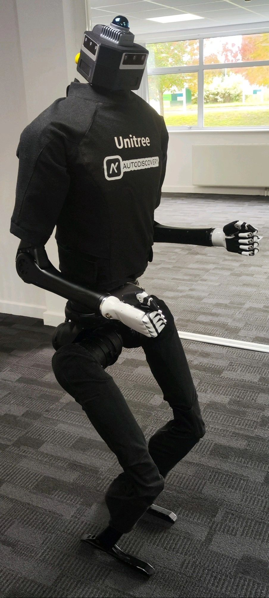

# Cerebro-Control - H1 Humanoid VR teleoperation while walking.
This code, developed by Autodiscovery, enables teleoperation of the Unitree H1 humanoid using a VR headset. It facilitates upper-body control by replicating human hand and finger movements in VR while maintaining locomotion through joystick-based reinforcement learning (RL). The implementation builds upon [avp_teleoperate](https://github.com/unitreerobotics/avp_teleoperate/tree/h1) by [Unitree Robotics](https://github.com/unitreerobotics) and [OpenTelevision](https://github.com/OpenTeleVision/TeleVision).

Watch our demo video on [LinkedIn](https://www.linkedin.com/posts/autodiscovery-robots_autodiscovery-robots-physicalintelligence-activity-7302486572199792640-PObD?utm_source=share&utm_medium=member_desktop&rcm=ACoAACBfWI0BowobH5dHrmolOK-csmED6Q8A0Ss)

This repository is designed to work with the stock Unitree H1 and is compatible with add-ons such as the Inspire Robot Dextrous Hands, as well as upgrades like the [Head360](https://autodiscovery.co.uk/equipment/head360.html) and [Hand16](https://autodiscovery.co.uk/equipment/hand16.html). For more information on the mentioned upgrades, please contact info@autodiscovery.co.uk or visit [Autodiscovery UK](https://autodiscovery.co.uk).

A key innovation of our approach is the enablement of teleoperation in sports mode, this approach enables the user to teleoperate the upper body while leaving the robot in sports mode making use of the RL model for locomotion and stability using the joystick controller. To highlight the differences and key advantages of our solution, we have compared our code with similar works, such as Unitree's avp_teleoperate, OpenTelevision, and [Human2Humanoid](https://github.com/LeCAR-Lab/human2humanoid), in the comparison table below:

<table class="tg"><thead>
  <tr>
    <th class="tg-baqh"></th>
    <th class="tg-amwm">Control method</th>
    <th class="tg-amwm">Support for locomotion</th>
    <th class="tg-amwm">Hand tracking support</th>
    <th class="tg-amwm">Data capture</th>
  </tr></thead>
<tbody>
  <tr>
    <td class="tg-amwm">Cerebro-Control</td>
    <td class="tg-baqh">VR Headset</td>
    <td class="tg-baqh">Yes, base Unitree walking RL <br>model enabled for locomotion</td>
    <td class="tg-baqh">Yes</td>
    <td class="tg-baqh">Coming soon</td>
  </tr>
  <tr>
    <td class="tg-amwm">Unitree - avp_teleoperate</td>
    <td class="tg-baqh">VR Headset</td>
    <td class="tg-baqh">No, robot needs to be either <br>hanging or seated</td>
    <td class="tg-baqh">Yes</td>
    <td class="tg-baqh">Yes for G1 and H1_2, <br>but not for H1</td>
  </tr>
  <tr>
    <td class="tg-amwm">OpenTeleVision</td>
    <td class="tg-baqh">VR Headset</td>
    <td class="tg-baqh">No, robot needs to be either <br>hanging or seated</td>
    <td class="tg-baqh">Yes</td>
    <td class="tg-baqh">No</td>
  </tr>
  <tr>
    <td class="tg-amwm">Human2humanoid</td>
    <td class="tg-baqh">Full body pose tracking <br>using RGBD cameras</td>
    <td class="tg-baqh">Yes, robot copies human locomotion <br>using custom full body RL model</td>
    <td class="tg-baqh">No</td>
    <td class="tg-baqh">Yes for custom <br>full body RL training</td>
  </tr>
</tbody></table>



## Requirements

<table class="tg"><thead>
  <tr>
    <th class="tg-c3ow"><span style="font-weight:bold">Sr. No.</span></th>
    <th class="tg-c3ow"><span style="font-weight:bold">Item</span></th>
    <th class="tg-c3ow"><span style="font-weight:bold">Requirement</span></th>
    <th class="tg-7btt"><span style="font-weight:bold">Comment</span></th>
  </tr></thead>
<tbody>
  <tr>
    <td class="tg-c3ow">1.</td>
    <td class="tg-c3ow">Unitree H1 Humanoid Robot with <br>development PC2 including joystick RC.</td>
    <td class="tg-c3ow">Mandatory</td>
    <td class="tg-c3ow">https://autodiscovery.co.uk/robots/h1.html</td>
  </tr>
  <tr>
    <td class="tg-c3ow">2.</td>
    <td class="tg-c3ow">Host PC or laptop</td>
    <td class="tg-c3ow">Mandatory</td>
    <td class="tg-c3ow">Preferably something with a powerful CPU <br>and at least 8 GB RAM. OS with either Ubuntu 24.04 or 22.04 version.</td>
  </tr>
  <tr>
    <td class="tg-c3ow">3.</td>
    <td class="tg-c3ow">A VR Headset</td>
    <td class="tg-c3ow">Mandatory</td>
    <td class="tg-c3ow">Supported only for Meta Quest 3.</td>
  </tr>
  <tr>
    <td class="tg-c3ow">4.</td>
    <td class="tg-c3ow">2 Human Operators with technical <br>knowledge to operate the equipment</td>
    <td class="tg-c3ow">Mandatory</td>
    <td class="tg-c3ow">Operator A to use the VR headset for teleoperation and <br>Operator B to control the H1 using the joystick.</td>
  </tr>
  <tr>
    <td class="tg-c3ow">5.</td>
    <td class="tg-c3ow">Inspire robot dexterous hands</td>
    <td class="tg-c3ow">Optional</td>
    <td class="tg-c3ow">https://en.inspire-robots.com/product-category/the-dexterous-hands</td>
  </tr>
  <tr>
    <td class="tg-c3ow">6.</td>
    <td class="tg-c3ow">Autodiscovery Hand 16</td>
    <td class="tg-c3ow">Optional</td>
    <td class="tg-c3ow">https://autodiscovery.co.uk/equipment/hand16.html</td>
  </tr>
  <tr>
    <td class="tg-baqh">7.</td>
    <td class="tg-baqh">Autodiscovery Head360</td>
    <td class="tg-baqh">Optional</td>
    <td class="tg-baqh">https://autodiscovery.co.uk/equipment/head360.html</td>
  </tr>
</tbody></table>

## Installation
This repository differs from avp_teleoperate in that it does not utilize the unitree_dds_wrapper for sending commands to the robot. Instead, it primarily relies on sockets. However, it does use the [unitree_sdk2](https://github.com/unitreerobotics/unitree_sdk2) to control the robot during sports mode. To set up and use this repository, please follow the steps below:

### Host PC:

  1. Clone this repository onto the host PC that will run your teleoperation code and be connected to the VR headset. Follow the commands below to setup the environment:
```bash
 conda create -n tv python=3.8
 conda activate tv
 conda install pinocchio -c conda-forge
 pip install meshcat
 pip install casadi
 cd avp_teleoperate
 pip install -r requirements.txt
 cd act/detr && pip install -e .
```

### Humanoid H1 - Development PC2:

  1. SSH into the PC2 used for H1 development and begin by cloning the [unitree_sdk2](https://github.com/unitreerobotics/unitree_sdk2). Follow the instructions to install and build it:
  2. The h1_joint.cpp program provided in our repository (located in the H1_sdk_cpp folder) needs to be placed into the unitree_sdk2/example/h1/low_level directory.
  3. Modify the CMakeLists.txt file in the unitree_sdk2/example/h1 folder by adding the following lines:
```bash
add_executable(h1_joint low_level/h1_joint.cpp)
target_link_libraries(h1_joint unitree_sdk2)
```
  4. Follow the build procedure again to compile and prepare the executable:
```bash
git clone https://github.com/unitreerobotics/unitree_sdk2.git
mkdir build
cd build
cmake ..
sudo make install
make
```
  5. Copy the programs from the Inspire Hand folder to a directory on the PC2 of the H1 for direct control of the hands. Ensure the hands are connected to the H1 PC2 via USB (default: USB0 for the right hand and USB1 for the left hand). Then, run the following command:
```bash
pip install -r requirements.txt
```

### Head 360 PC (Optional):

  1. Finally, place the code from the Head360 folder onto the head PC to stream video data to the socket. Alternatively, you can develop your own code and use an external camera to send data to the VR headset by ensuring the correct IP and port addresses for the host PC are used.

## Device setup

To connect the Meta Quest 3 VR headset to the Host PC, you must first enable developer permissions on the headset. The instructions for enabling developer mode can be found [here](https://developers.meta.com/horizon/documentation/native/android/mobile-device-setup/).

Next, you have two options for the connection: wired or wireless. For both methods, you will need to install Android Debug Bridge (ADB tools) on your Host PC. You can do this by running the following command:
```bash
sudo apt-get install android-sdk-platform-tools
```

1. To establish a wired ADB connection, connect your Quest 3 headset to your Host PC using a USB-C cable. Ensure the cable supports high data transfer speeds for video streaming. Once connected, a permission prompt will appear in the notifications on your VR headset. After granting permission, run the following command in your terminal to check the connection status:
```bash
adb devices
```
The result should display the device address and show the status as connected. If the status shows unrecognized or no permissions, check your developer settings or the notification prompt on your headset.

2. To connect wirelessly, first, install SideQuest on the Meta Quest 3 by following the instructions [here](https://medium.com/sidequestvr/how-to-install-sidequest-on-your-quest-3-e5be0e6bb9f9). After installation, open SideQuest on your headset, open the side menu (three bars on the left), and navigate to "Device Settings." In this menu, you will find the wireless ADB options for your device.

To enable wireless ADB for the first time (and each time the device is rebooted), follow these steps:

  i) Connect the headset to your Host PC via USB and grant permissions through the notification prompt on the headset.
  
  ii) In the terminal, run the following command to enable wireless ADB: 
```bash
adb tcpip 5555
```

Here, 5555 is the fixed port number for the wireless ADB setup. This step ensures that the ADB connection remains on the same port, even if the network changes. Without this command, the port number may change every time the headset switches networks or reconnects.

  iii) In SideQuest, enable wireless ADB from the device settings. Once completed, you can disconnect the USB cable and establish a wireless connection by running the following command in your terminal (assuming the device IP is 192.168.123.249):
```bash
adb connect 192.168.123.249:5555
```
You should now see the same connection status as when using the wired connection. To obtain the correct IP address and port, you can disable wireless ADB in the SideQuest menu. This acts as a refresh if you have already run the adb tcpip 5555 command. Note that the SideQuest app may not immediately show the IP change when switching networks. If this happens, use the disable wifi adb option as a refresh.

## Usage
It is strongly recommended to set up Conda environments on the host PC, the H1 PC2, and the Head360 PC. All devices, including the VR headset, should be connected to the same network. To start the teleoperation, follow these steps in the correct order:
  1. Operator A should power on the H1 and put it into sports mode, while controlling the locomotion using the RC joystick. Operator A must ensure that the H1's hands do not enter the field of view (FOV) of the VR headset that Operator B is using.
  2. Operator B should SSH into the H1 PC2. Once the H1 is in sports mode, execute the compiled binary executable from unitree_sdk2, using the interface name as an argument. For example, assuming the interface name is enp31sf6 (this can be found using ifconfig):
```bash
./h1_joint enp31sf6
```
  3. Once the arms are initialized and the socket is ready, Operator B should run the hand control program from the Inspire Hand folder (Please note that this part of the code is assuming that you're using the Inspire robots dextrous hands. Support for other hands coming soon). Assuming the hands are connected via USB to the robot as USB0 - right hand and USB1 - left hand, follow these steps to control them via python:
```bash
sudo chmod 666 /dev/ttyUSB0
sudo chmod 666 /dev/ttyUSB1
python teleop_hand.py
```
  4. After the hand socket is listening, Operator B should SSH into the Head360 PC and start the camera socket with the following command:
```bash
python head_cam.py
```
  5. Next, connect and set up the VR headset (Quest 3 by default, with the IP address assumed to be 192.168.123.249:
```bash
adb connect 192.168.123.249:5555
adb reverse tcp:8012 tcp:8012
```
  6. Finally, start the teleoperation program located in the avp_teleoperate/teleop directory:
```bash
python teleop_hand_and_arm.py
```
  7. The terminal should prompt you to start the program by entering the character 's'. Before doing this, Operator B needs to open the browser on the VR headset, navigate to localhost:8012, and click the "Enter VR" button.
  8. Now, Operator B can assume the pose shown in the visualizer, and Operator A can press 's' and Enter to begin the teleoperation.

## Exit and Restart procedure
To exit the teleoperation program, a keyboard interrupt is required in the main terminal running teleop_hand_and_arm.py. In some cases, you may need to interrupt the process 2-3 times to ensure the code exits completely. Once interrupted, the socket connection to the unitree_Sdk2 program controlling the H1 will be dropped, returning the robot to its zero position. However, the sockets for the hands and head will remain active and must be turned off manually.

If you wish to restart the teleoperation, the control code from unitree_sdk2 must be relaunched, as outlined in step 2 of the Usage section, before relaunching the main Python teleoperation script. This script has been designed so that if the main teleoperation socket connection drops for any reason, the robot automatically returns to its zero state and exits the control program for safety purposes.

During operation, if the robot performs an undesired action (possibly due to an unknown error or if the hands are lost from the VR field of view), Operator A can immediately shut the robot down by pressing L1 + A on the handheld joystick. This will return the robot to damping mode and act as an emergency stop. This feature was not available in Unitree's evp_teleoperate, as their execution occurs in developer or debug mode, which does not support returning to damping mode with L1 + A, thus lacking an emergency stop on the handheld joystick. In contrast, our code operates in sports mode, enabling this functionality.

## References
1. https://github.com/unitreerobotics/avp_teleoperate/tree/h1
2. https://github.com/unitreerobotics/unitree_sdk2/tree/main
3. https://github.com/OpenTeleVision/TeleVision
4. https://github.com/LeCAR-Lab/human2humanoid
5. https://github.com/dexsuite/dex-retargeting
6. https://github.com/vuer-ai/vuer
7. https://github.com/stack-of-tasks/pinocchio
8. https://github.com/casadi/casadi
9. https://github.com/meshcat-dev/meshcat-python
10. https://github.com/zeromq/pyzmq
11. https://github.com/tonyzhaozh/act
12. https://github.com/facebookresearch/detr
